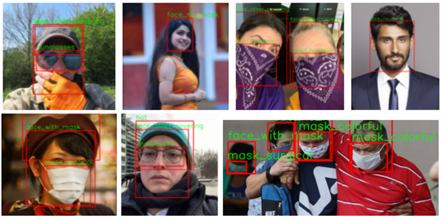

# Soft Computing Assignment - Face mask Classification
Create or train a model to classify mask wearing condition.

## Dataset

[Face mask detection dataset (Kaggle)](https://www.kaggle.com/wobotintelligence/face-mask-detection-dataset)

## Results

